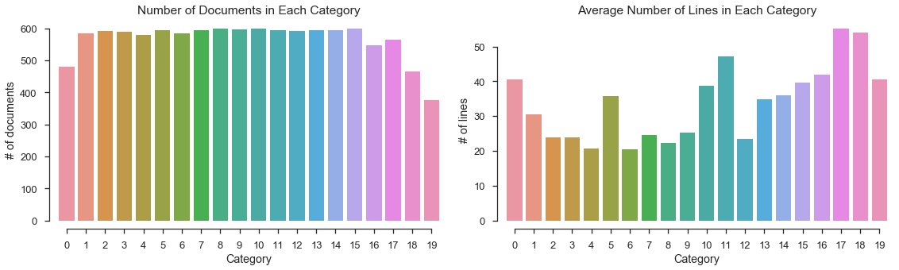

# Capstone Proposal: Document Classification

## 1. 项目背景

文档分类是根据文档内容将文档标分配到某一个或多个事先定义好的类别中[@Jindal2015TechniquesFT]。在图书馆学中，大部分传统的文档分类工作是由人工完成的。如今，人们获取的绝大部分信息来自于数字化内容，从网页内容到电子邮件，从科技杂志到电子图书，从纯文本到图片音乐， 数字化内容持续呈井喷趋势。在海量的数字化内容的淹没下，人工所能完成的分类工作显然是杯水车薪。当前，得益于计算机科学和信息科学的发展，几乎所有的数字化内容，包括文本文档和图片音乐等，均可以由算法来完成内容的分类. 

在使用算法处理分类问题时，需要结构化的固定长度的输入与输出，而原始的文本文档的内容长短不一且是非结构化的[@pmlr-v32-le14]。在计算机科学和信息科学中，文档分类所要解决的第一个问题是非结构化的数据问题，需要将自然语言内容转换为计算机所能处理的数学表达形式。N-gram模型就是一种处理该问题的常用方法，模型根据统计计算临近词中后一个词在前一个词后出现的条件概率，将文本内容表示为概率模型[^2]。词袋（Bag-of-Words，BoW）模型在文档和句子表达上也应用广泛，模型将文本内容用其所包含的每个单词的数量作为文档特征，BoW模型忽略掉了单词的顺序特征和单词间的语法关系[@pmlr-v32-le14]。随着深度学习技术的快速发展，基于神经网络的Word2Vec和GloVec等词向量模型在NLP问题中被广泛采用[^4]。

在分类问题上，Naive Bayes，Decision Tree，SVM等一批分类模型被广泛采用，基于它们各自的特点分别被用于多个领域。在本项目中，将采用以上Naive Bayes和SVM模型对新闻文档进行分类，并尝试使神经网络分类以对比不同分类方法的结果。

## 2. 问题描述

本项目要解决的是个监督学习的问题，通过使用已分类的数据训练分类模型，而后在测试集上对模型进行测试，评估模型表现。对于文本数据，只要能将文本内容表示为某种固定长度的向量形式，将向量带入分类模型对分类器进行训练，便可得到可用于分类的模型。此时，文本分类问题就变为了普通的监督学习分类问题。所以，本项目中需要解决两个问题：1. 将原始的文本数据表示为数学向量并提取出有效的数据特征，2. 训练出有效的分类模型对数据进行分类。可通过对模型分类结果的准确性的评估来判断文本分类的表现。

### 3. 数据集和输入

项目使用的数据集为经典的20 Newsgroup数据集[@Lang95]，可直接从数据集的[官网](http://www.qwone.com/~jason/20Newsgroups/)下载，也可以使用sklearn提供的[工具包](http://scikit-learn.org/stable/modules/generated/sklearn.datasets.fetch_20newsgroups.html)下载使用。本项目使用sklean工具获取数据。

该数据集共包约20000条新闻数据，被相对均匀地划分为20个不同的分类，这些数据按60%:40%的比例划分为训练集和测试集，非常适合用来做监督学习多分类的实验。每条新闻数据包含新闻头部、正文和新闻署名（脚部）三个部分，考虑到头部和署名内容所包含的内容信息基本为零，在使用数据时，可能需要考虑对头部和脚部内容做清理。

## 4. 解决方案

按照 2 中的描述，要对文本进行分类，需要先将文本内容向量化。可采用sklearn提供的`CountVectorizer`方法，根据单词在文档中出现的次数将文档向量化；也可以使用TFIDF模型，通过计算每个单词在文档中出现的频率（TF）和单词的逆文档频率（IDF）来综合确定单词的向量权重，得到矫正权重的词向量；还尝试使用Word2vec模型[@rehurek_lrec]来计算文档的词向量。

分类时，考虑先使用常规的多分类器如Navie Bayes、SVM等来解决分类问题，然后探索使用神经网络来进行多分类，对比各种方法的分类表现。	

## 5. 基准模型

有很多研究人员对20 Newsgroup数据集做过文档分类的研究，这里主要参考了两个研究结果。斯坦福的研究人员用自己的分类器Stanford Classifier对整个20个类别的数据做分类得到的准确率在0.877到0.888之间[^4]。Lan等[@Lan:2006:PNT:1597538.1597660]采用TFRF模型对文本进行向量化处理，并使用线性SVM得到的平均准确率为0.808。

本项目也将尝试对全部20个分类进行模型训练和预测，参考上面两个团队的结果，模型的准确性最低应该在0.8的水平。

## 6. 评估指标

本项目要解决的是多分类问题，对于分类问题，最直接的评估指标就是分类的正确率或准确率，即分类正确的文档数量在整个测试集文档中的占比。所以，优先考虑以准确率为分类模型的评估指标。准确率的计算公式如下
$$
\mathrm{accuracy}(y,\hat y) = \frac{1}{N} \cdot \sum^N_{i=1} 1(y_i =\hat y_i)
$$
其中，$N$是测试数据集中文档的数量； $y_i$是文档$i$的真实分类；$\hat y_i$是模型的分类结果；$1(y_i =\hat y_i)$是目标函数，当$y_i = \hat y_i$时值取1，其他情况下值为0。

## 7. 项目设计

按照 2 中对本项目所要解决的问题的定义，前后需要解决两个问题：文本数据的向量化和分类模型的建立。其中，在将文本数据转化为向量表示前，还需要对原始数据进行清洗，比如原文档里新闻的头部和尾部内容并不能提供很多文档信息，需要做清理。此外，还需要对文档做分词并去除英文停用词。对文本的向量化处理，考虑分别使用TFIDF和Word2Vec模型。分类模型考虑使用 Naive Bayes、SVM (linear)和神经网络来分别训练分类器。

结合以上说明介绍和思考，本项目的具体实验步骤如下：

1. 清理文档，去除每篇文档的尾部（签名），文档的头部内容中，Objective和Organization中的信息可能在一定程度上提供了文档的信息，考虑保留，头部其余内容全部清理；此外还需要对文档的其他特征进行探索，以便能找出更多有用的特征，比如，下图是每个类别下文档的数量和平均句子数量；

2. 对文档做分词处理，分词工具考虑使用NLTK提供的`RegexpTokenizer`，使用正则分词，同时去掉停用词；

3. 分词后文本的向量化，考虑分别使用BoW和Embedding的方法：

   - BoW - 使用sklearn提供的`CountVectorizer`和`TfidfTransformer`工具，先将文档分词得到的单词进行计数，得到词频向量，然后在使用TFIDF进行权重矫正
   - Embedding - 使用gensim提供的Word2Vec工具，直接做向量化处理

   两种方法得到的词向量分别带入分类模型训练；

4. 对于分类模型，Naive Bayes、SVM (linear) 考虑使用 GridSearch方法调参找到最优的参数设置，神经网络模型考虑使用keras的相关API。

5. 衡量模型分类结果的指标为预测分类的准确率，计算公式在前文有介绍。

[^1]: https://www.wikiwand.com/en/N-gram#/overview
[^2]: https://www.wikiwand.com/en/Bag-of-words_model
[^3]: http://blog.aylien.com/overview-word-embeddings-history-word2vec-cbow-glove/
[^4]: https://nlp.stanford.edu/wiki/Software/Classifier/20_Newsgroups
[^5]: https://radimrehurek.com/gensim/index.html

## 参考文献
