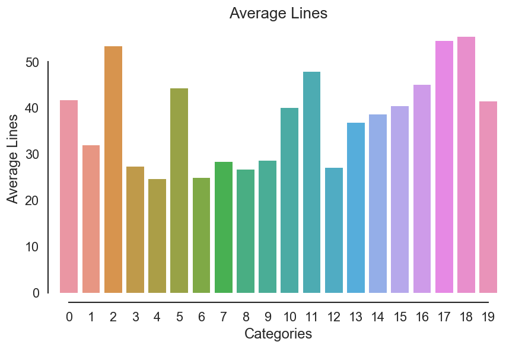

# Capstone Proposal: Document Classification

## 1. 项目背景

文档分类是根据文档内容将文档标分配到某一个或多个事先定义好的类别中[@Jindal2015TechniquesFT]。在图书馆学中，大部分传统的文档分类工作是由人工完成的。如今，人们获取的绝大部分信息来自于数字化内容，从网页内容到电子邮件，从科技杂志到电子图书，从纯文本到图片音乐， 数字化内容持续呈井喷趋势。在海量的数字化内容的淹没下，人工所能完成的分类工作显然是杯水车薪。当前，得益于计算机科学和信息科学的发展，几乎所有的数字化内容，包括文本文档和图片音乐等，均可以由算法来完成内容的分类. 

在使用算法处理分类问题时，需要结构化的固定长度的输入与输出，而原始的文本文档的内容长短不一且是非结构化的。在计算机科学和信息科学中，文档分类所要解决的第一个问题是非结构化的数据问题，需要将自然语言内容转换为计算机所能处理的数学表达形式。N-gram模型就是一种处理该问题的常用方法，模型根据统计计算临近词中后一个词在前一个词后出现的条件概率，将文本内容表示为概率模型[^2]。词袋（Bag-of-Words，BoW）模型在文档和句子表达上也应用广泛，模型将文本内容用其所包含的每个单词的数量作为文档特征，BoW模型忽略掉了单词的顺序特征和单词间的语法关系[@pmlr-v32-le14]。随着深度学习技术的快速发展，基于神经网络的Word2Vec和GloVec等词向量模型在NLP问题中被广泛采用[^4]。

在分类问题上，Naive Bayes，Decision Tree，SVM等一批分类模型被广泛采用，基于它们各自的特点分别被用于多个领域。在本项目中，将采用以上三种分类模型对新闻文档进行分类，并尝试使神经网络分类以对比不同分类方法的结果。

## 2. 问题描述

本项目要解决的是个监督学习的问题，通过使用已分类的数据训练分类模型，而后在测试集上对模型进行测试。对于文本数据，只要能将文本内容表示为某种固定长度的向量形式，将向量带入分类模型对模型进行训练，便可得到可用于分类的模型。此时，文本分类问题就变为了普通的监督学习分类问题。所以，本项目中需要解决两个问题：1. 将原始的文本数据表示为数学向量并提取出有效的数据特征，2. 训练出有效的分类模型对数据进行分类。可通过对模型分类结果的准确性的评估来判断文本分类的表现。

### 3. 数据集和输入

项目使用的数据集为经典的20 Newsgroup数据集[@Lang95]，可直接从数据集的[官网](http://www.qwone.com/~jason/20Newsgroups/)下载，也可以使用`sklearn`提供的[工具包](http://scikit-learn.org/stable/modules/generated/sklearn.datasets.fetch_20newsgroups.html)下载使用。

该数据集共包约20000条新闻数据，被相对均匀地划分为20个不同的分类，这些数据按60%:40%的比例划分为训练集和测试集，非常适合用来做监督学习多分类的实验。每条新闻数据包含新闻头部、正文和新闻署名（脚部）三个部分，考虑到头部和署名内容所包含的内容信息基本为零，在使用数据时，可能需要考虑对头部和脚部内容做清理。

## 4. 解决方案

按照 2 中的描述，要对文本进行分类，需要先将文本内容向量化。可采用`sklearn`提供的`CountVectorizer`方法，根据单词在文档中出现的次数将文档向量化；也可以使用TFIDF模型，通过计算每个单词在文档中出现的频率（TF）和单词的逆文档频率（IDF）来综合确定单词的向量权重，得到矫正权重的词向量；还尝试使用Word2vec模型[@rehurek_lrec]来计算文档的词向量。

分类时，考虑先使用常规的多分类器如Navie Bayes、SVM等来解决分类问题，然后探索使用神经网络来进行多分类，对比各种方法的分类表现。	

## 5. 基准模型

有很多研究人员对20 Newsgroup数据集做过文档分类的研究，这里主要参考了两个研究结果。斯坦福的研究人员用自己的分类器Stanford Classifier对整个20个类别的数据做分类得到的准确率在0.877到0.888之间[^4]。Lan等[@Lan:2006:PNT:1597538.1597660]采用TFRF模型对文本进行向量化处理，并使用线性SVM得到的平均准确率为0.808。

本项目也将尝试对全部20个分类进行模型训练和预测，参考上面两个团队的结果，模型的准确性最低应该在0.8的水平。

## 6. 评估指标

本项目要解决的是多分类问题，对于分类问题，最直接的评估指标就是分类的正确率或准确率，即分类正确的文档数量在整个测试集文档中的占比。所以，优先考虑以准确率为分类模型的评估指标。准确率的计算公式如下
$$
\mathrm{accuracy}(y,\hat y) = \frac{1}{N} \cdot \sum^N_{i=1} 1(y_i =\hat y_i)
$$
其中，$N$是测试数据集中文档的数量； $y_i$是文档$i$的真实分类；$\hat y_i$是模型的分类结果；$1(y_i =\hat y_i)$是目标函数，当$y_i = \hat y_i$时值取1，其他情况下值为0。

## 7. 项目设计

> *In this final section, **summarize a theoretical workflow** for approaching a solution given the problem. Provide **thorough discussion** for what **strategies** you may consider employing, what **analysis of the data** might be required before being used, or **which algorithms** will be considered for your implementation. The workflow and discussion that you provide should align with the qualities of the previous sections. Additionally, you are encouraged to **include small visualizations**, **pseudo code**, or **diagrams** to aid in describing the project design, but it is not required. The discussion should clearly outline your intended workflow of the capstone project.*

按照 2 中对本项目所要解决的问题的定义，需要前后解决两个问题：文本数据的向量化和分类模型的建立。

### 7.1 数据预处理

在将文本数据向量化表达之前，需要深入抽样分析原始文档的具体内容，找出文档内容的基本特征，比如，以对原始文档数据进行清洗，剔除不必要的特征。

将清洗后的文本进行向量化表达时，考虑使用2种方法：TFIDF模型和Word2vec模型。可通过使用`sklearn`提供的`TfidfVectorizer`工具来将文本转化为TFIDF向量。Word2vec向量可使用`gensim`[^5]工具来获得。




### 7.2 建立分类模型

```
import pandas as pd
```


[^1]: https://www.wikiwand.com/en/N-gram#/overview
[^2]: https://www.wikiwand.com/en/Bag-of-words_model
[^3]: http://blog.aylien.com/overview-word-embeddings-history-word2vec-cbow-glove/
[^4]: https://nlp.stanford.edu/wiki/Software/Classifier/20_Newsgroups
[^5]: https://radimrehurek.com/gensim/index.html

## 参考文献
